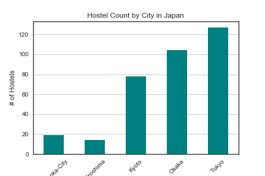
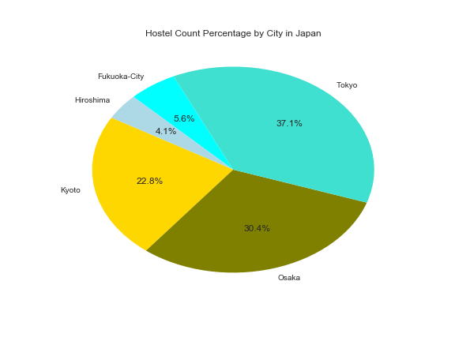
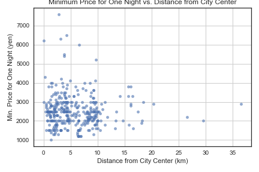
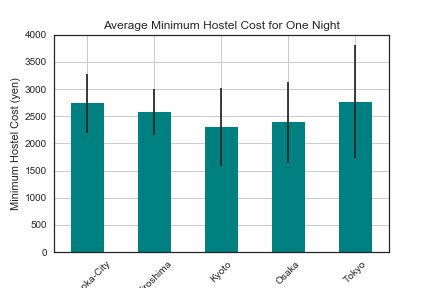
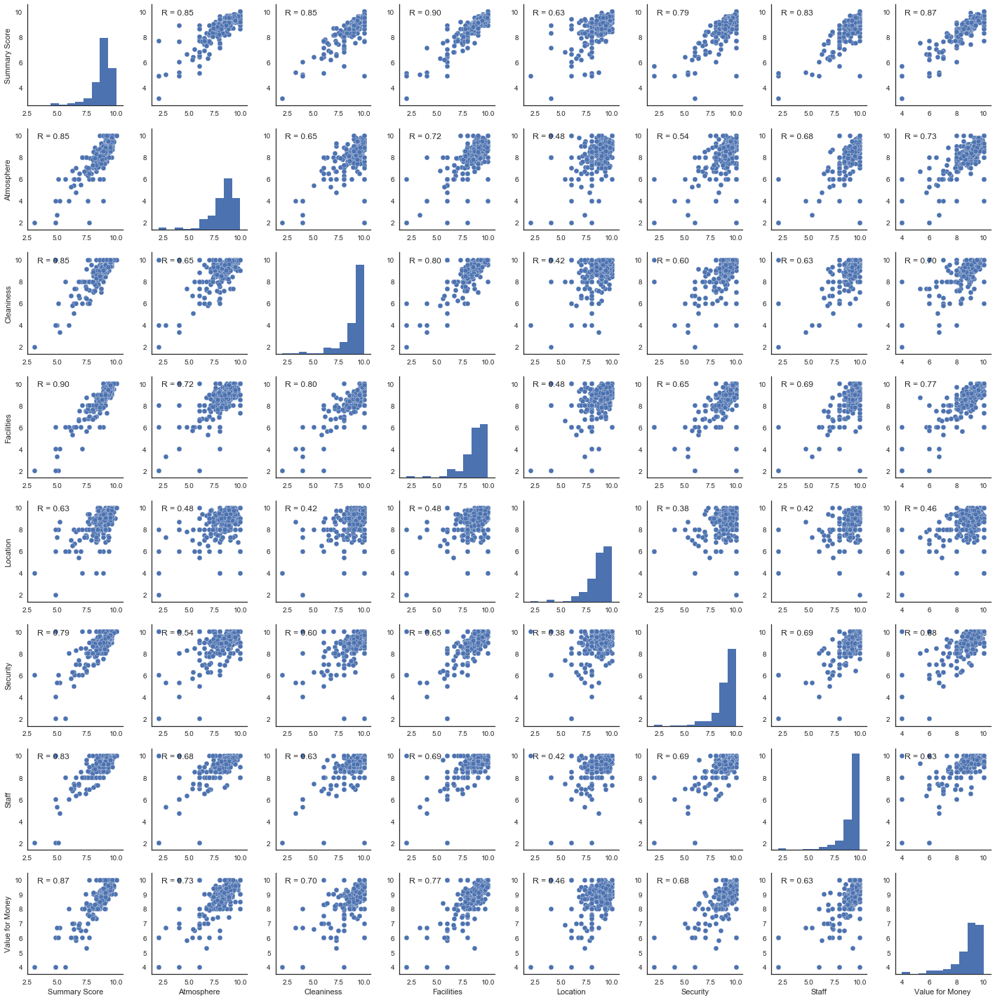
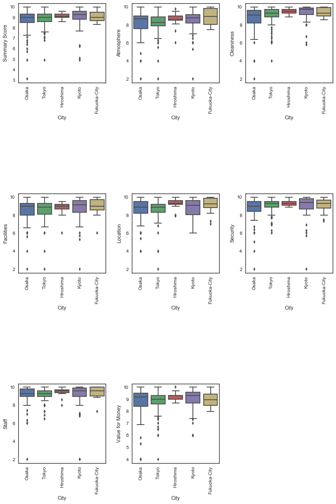

# Exploratory Data Analysis (EDA) on Hostels in Japan using Python

An analysis on an affordable lodging option for travelers using Pandas, Matplotlib, Seaborn and Scipy modules.

## Data Source

This dataset was webscraped from Hostelworld by Koki Ando and is available to the public on Kaggle (https://www.kaggle.com/koki25ando/hostel-world-dataset).


## Reading CSV File and Data Clean-Up

```python
# Dependencies
import pandas as pd
import matplotlib.pyplot as plt
from scipy import stats
import seaborn as sns
from wordcloud import WordCloud
```


```python
hostels_df = pd.read_csv("../raw_data/Hostel.csv", index_col=0)
```


```python
# Rename column names
hostels_df.columns = ["Hostel Name", "City", "Min. Price for One Night (yen)", 
                      "Distance from City Center", "Summary Score", "Rating", "Atmosphere", 
                      "Cleaniness", "Facilities", "Location", "Security", "Staff", "Value for Money", 
                      "Longitude", "Latitude"]
hostels_df.head()
```


<div>
<table border="1" class="dataframe">
  <thead>
    <tr style="text-align: right;">
      <th></th>
      <th>Hostel Name</th>
      <th>City</th>
      <th>Min. Price for One Night (yen)</th>
      <th>Distance from City Center</th>
      <th>Summary Score</th>
      <th>Rating</th>
      <th>Atmosphere</th>
      <th>Cleaniness</th>
      <th>Facilities</th>
      <th>Location</th>
      <th>Security</th>
      <th>Staff</th>
      <th>Value for Money</th>
      <th>Longitude</th>
      <th>Latitude</th>
    </tr>
  </thead>
  <tbody>
    <tr>
      <th>1</th>
      <td>"Bike &amp; Bed" CharinCo Hostel</td>
      <td>Osaka</td>
      <td>3300</td>
      <td>2.9km from city centre</td>
      <td>9.2</td>
      <td>Superb</td>
      <td>8.9</td>
      <td>9.4</td>
      <td>9.3</td>
      <td>8.9</td>
      <td>9.0</td>
      <td>9.4</td>
      <td>9.4</td>
      <td>135.513767</td>
      <td>34.682678</td>
    </tr>
    <tr>
      <th>2</th>
      <td>&amp; And Hostel</td>
      <td>Fukuoka-City</td>
      <td>2600</td>
      <td>0.7km from city centre</td>
      <td>9.5</td>
      <td>Superb</td>
      <td>9.4</td>
      <td>9.7</td>
      <td>9.5</td>
      <td>9.7</td>
      <td>9.2</td>
      <td>9.7</td>
      <td>9.5</td>
      <td>NaN</td>
      <td>NaN</td>
    </tr>
    <tr>
      <th>3</th>
      <td>&amp;And Hostel Akihabara</td>
      <td>Tokyo</td>
      <td>3600</td>
      <td>7.8km from city centre</td>
      <td>8.7</td>
      <td>Fabulous</td>
      <td>8.0</td>
      <td>7.0</td>
      <td>9.0</td>
      <td>8.0</td>
      <td>10.0</td>
      <td>10.0</td>
      <td>9.0</td>
      <td>139.777472</td>
      <td>35.697447</td>
    </tr>
    <tr>
      <th>4</th>
      <td>&amp;And Hostel Ueno</td>
      <td>Tokyo</td>
      <td>2600</td>
      <td>8.7km from city centre</td>
      <td>7.4</td>
      <td>Very Good</td>
      <td>8.0</td>
      <td>7.5</td>
      <td>7.5</td>
      <td>7.5</td>
      <td>7.0</td>
      <td>8.0</td>
      <td>6.5</td>
      <td>139.783667</td>
      <td>35.712716</td>
    </tr>
    <tr>
      <th>5</th>
      <td>&amp;And Hostel-Asakusa North-</td>
      <td>Tokyo</td>
      <td>1500</td>
      <td>10.5km from city centre</td>
      <td>9.4</td>
      <td>Superb</td>
      <td>9.5</td>
      <td>9.5</td>
      <td>9.0</td>
      <td>9.0</td>
      <td>9.5</td>
      <td>10.0</td>
      <td>9.5</td>
      <td>139.798371</td>
      <td>35.727898</td>
    </tr>
  </tbody>
</table>
</div>


```python
# Get hostel count for each city
city_group = hostels_df.groupby("City").count()
city_group
```


<div>
<table border="1" class="dataframe">
  <thead>
    <tr style="text-align: right;">
      <th></th>
      <th>Hostel Name</th>
      <th>Min. Price for One Night (yen)</th>
      <th>Distance from City Center</th>
      <th>Summary Score</th>
      <th>Rating</th>
      <th>Atmosphere</th>
      <th>Cleaniness</th>
      <th>Facilities</th>
      <th>Location</th>
      <th>Security</th>
      <th>Staff</th>
      <th>Value for Money</th>
      <th>Longitude</th>
      <th>Latitude</th>
    </tr>
    <tr>
      <th>City</th>
      <th></th>
      <th></th>
      <th></th>
      <th></th>
      <th></th>
      <th></th>
      <th></th>
      <th></th>
      <th></th>
      <th></th>
      <th></th>
      <th></th>
      <th></th>
      <th></th>
    </tr>
  </thead>
  <tbody>
    <tr>
      <th>Fukuoka-City</th>
      <td>19</td>
      <td>19</td>
      <td>19</td>
      <td>17</td>
      <td>17</td>
      <td>17</td>
      <td>17</td>
      <td>17</td>
      <td>17</td>
      <td>17</td>
      <td>17</td>
      <td>17</td>
      <td>14</td>
      <td>14</td>
    </tr>
    <tr>
      <th>Hiroshima</th>
      <td>14</td>
      <td>14</td>
      <td>14</td>
      <td>14</td>
      <td>14</td>
      <td>14</td>
      <td>14</td>
      <td>14</td>
      <td>14</td>
      <td>14</td>
      <td>14</td>
      <td>14</td>
      <td>13</td>
      <td>13</td>
    </tr>
    <tr>
      <th>Kyoto</th>
      <td>78</td>
      <td>78</td>
      <td>78</td>
      <td>73</td>
      <td>73</td>
      <td>73</td>
      <td>73</td>
      <td>73</td>
      <td>73</td>
      <td>73</td>
      <td>73</td>
      <td>73</td>
      <td>66</td>
      <td>66</td>
    </tr>
    <tr>
      <th>Osaka</th>
      <td>104</td>
      <td>104</td>
      <td>104</td>
      <td>101</td>
      <td>101</td>
      <td>101</td>
      <td>101</td>
      <td>101</td>
      <td>101</td>
      <td>101</td>
      <td>101</td>
      <td>101</td>
      <td>89</td>
      <td>89</td>
    </tr>
    <tr>
      <th>Tokyo</th>
      <td>127</td>
      <td>127</td>
      <td>127</td>
      <td>122</td>
      <td>122</td>
      <td>122</td>
      <td>122</td>
      <td>122</td>
      <td>122</td>
      <td>122</td>
      <td>122</td>
      <td>122</td>
      <td>116</td>
      <td>116</td>
    </tr>
  </tbody>
</table>
</div>


```python
# Reset index
city_group = city_group.reset_index()
city_group
```


<div>
<table border="1" class="dataframe">
  <thead>
    <tr style="text-align: right;">
      <th></th>
      <th>City</th>
      <th>Hostel Name</th>
      <th>Min. Price for One Night (yen)</th>
      <th>Distance from City Center</th>
      <th>Summary Score</th>
      <th>Rating</th>
      <th>Atmosphere</th>
      <th>Cleaniness</th>
      <th>Facilities</th>
      <th>Location</th>
      <th>Security</th>
      <th>Staff</th>
      <th>Value for Money</th>
      <th>Longitude</th>
      <th>Latitude</th>
    </tr>
  </thead>
  <tbody>
    <tr>
      <th>0</th>
      <td>Fukuoka-City</td>
      <td>19</td>
      <td>19</td>
      <td>19</td>
      <td>17</td>
      <td>17</td>
      <td>17</td>
      <td>17</td>
      <td>17</td>
      <td>17</td>
      <td>17</td>
      <td>17</td>
      <td>17</td>
      <td>14</td>
      <td>14</td>
    </tr>
    <tr>
      <th>1</th>
      <td>Hiroshima</td>
      <td>14</td>
      <td>14</td>
      <td>14</td>
      <td>14</td>
      <td>14</td>
      <td>14</td>
      <td>14</td>
      <td>14</td>
      <td>14</td>
      <td>14</td>
      <td>14</td>
      <td>14</td>
      <td>13</td>
      <td>13</td>
    </tr>
    <tr>
      <th>2</th>
      <td>Kyoto</td>
      <td>78</td>
      <td>78</td>
      <td>78</td>
      <td>73</td>
      <td>73</td>
      <td>73</td>
      <td>73</td>
      <td>73</td>
      <td>73</td>
      <td>73</td>
      <td>73</td>
      <td>73</td>
      <td>66</td>
      <td>66</td>
    </tr>
    <tr>
      <th>3</th>
      <td>Osaka</td>
      <td>104</td>
      <td>104</td>
      <td>104</td>
      <td>101</td>
      <td>101</td>
      <td>101</td>
      <td>101</td>
      <td>101</td>
      <td>101</td>
      <td>101</td>
      <td>101</td>
      <td>101</td>
      <td>89</td>
      <td>89</td>
    </tr>
    <tr>
      <th>4</th>
      <td>Tokyo</td>
      <td>127</td>
      <td>127</td>
      <td>127</td>
      <td>122</td>
      <td>122</td>
      <td>122</td>
      <td>122</td>
      <td>122</td>
      <td>122</td>
      <td>122</td>
      <td>122</td>
      <td>122</td>
      <td>116</td>
      <td>116</td>
    </tr>
  </tbody>
</table>
</div>


```python
# Create new data frame for city name and hostel count
city_group = city_group[["City", "Hostel Name"]]
city_group
```

<div>
<table border="1" class="dataframe">
  <thead>
    <tr style="text-align: right;">
      <th></th>
      <th>City</th>
      <th>Hostel Name</th>
    </tr>
  </thead>
  <tbody>
    <tr>
      <th>0</th>
      <td>Fukuoka-City</td>
      <td>19</td>
    </tr>
    <tr>
      <th>1</th>
      <td>Hiroshima</td>
      <td>14</td>
    </tr>
    <tr>
      <th>2</th>
      <td>Kyoto</td>
      <td>78</td>
    </tr>
    <tr>
      <th>3</th>
      <td>Osaka</td>
      <td>104</td>
    </tr>
    <tr>
      <th>4</th>
      <td>Tokyo</td>
      <td>127</td>
    </tr>
  </tbody>
</table>
</div>


```python
# Rename columns
city_group.rename(columns={"Hostel Name": "Hostel Count"}, inplace=True)
```

<div>
<table border="1" class="dataframe">
  <thead>
    <tr style="text-align: right;">
      <th></th>
      <th>City</th>
      <th>Hostel Count</th>
    </tr>
  </thead>
  <tbody>
    <tr>
      <th>0</th>
      <td>Fukuoka-City</td>
      <td>19</td>
    </tr>
    <tr>
      <th>1</th>
      <td>Hiroshima</td>
      <td>14</td>
    </tr>
    <tr>
      <th>2</th>
      <td>Kyoto</td>
      <td>78</td>
    </tr>
    <tr>
      <th>3</th>
      <td>Osaka</td>
      <td>104</td>
    </tr>
    <tr>
      <th>4</th>
      <td>Tokyo</td>
      <td>127</td>
    </tr>
  </tbody>
</table>
</div>


## Basic Visualizations using Matplotlib Charts 
- Tokyo, Osaka, and Kyoto are the top three cities for hostel counts which comes to no surprise with those cities being the top tourist destinations in Japan.


```python
# Create bar chart for hostel count by city
city_bar = city_group.plot.bar(x="City", y="Hostel Count", rot=90, legend=None, color="teal", zorder=3)
plt.grid(which="major", axis="y", zorder=0)
plt.xticks(rotation=45)
plt.title("Hostel Count by City in Japan")
plt.ylabel("# of Hostels")
plt.savefig("../reports/figures/hostel_bar.png")
plt.show()
```





- As seen in the pie chart below, more than 1/3 of the hostels are located in Tokyo. Around 2/3 of the hostels are located in Tokyo and Osaka.


```python
# Create pie chart for hostel count by city
hostel_count = city_group["Hostel Count"]
colors = ["aqua", "lightblue", "gold", "olive", "turquoise"]
city_labels = city_group["City"]
plt.figure(figsize=(8,6))
plt.pie(hostel_count, labels=city_labels, colors=colors, startangle=115, autopct="%1.1f%%")

plt.title("Hostel Count Percentage by City in Japan")
plt.savefig("../reports/figures/hostel_pie.png")
plt.show()
```





```python
# Use split to obtain numeric value from distance column
hostels_df["Distance from City Center (km)"] = hostels_df["Distance from City Center"].str.split("km").str[0]
```

```python
# Drop unneeded column
hostels_df = hostels_df.drop(["Distance from City Center"], axis=1)
hostels_df.head()
```


<div>

<table border="1" class="dataframe">
  <thead>
    <tr style="text-align: right;">
      <th></th>
      <th>Hostel Name</th>
      <th>City</th>
      <th>Min. Price for One Night (yen)</th>
      <th>Summary Score</th>
      <th>Rating</th>
      <th>Atmosphere</th>
      <th>Cleaniness</th>
      <th>Facilities</th>
      <th>Location</th>
      <th>Security</th>
      <th>Staff</th>
      <th>Value for Money</th>
      <th>Longitude</th>
      <th>Latitude</th>
      <th>Distance from City Center (km)</th>
    </tr>
  </thead>
  <tbody>
    <tr>
      <th>1</th>
      <td>"Bike &amp; Bed" CharinCo Hostel</td>
      <td>Osaka</td>
      <td>3300</td>
      <td>9.2</td>
      <td>Superb</td>
      <td>8.9</td>
      <td>9.4</td>
      <td>9.3</td>
      <td>8.9</td>
      <td>9.0</td>
      <td>9.4</td>
      <td>9.4</td>
      <td>135.513767</td>
      <td>34.682678</td>
      <td>2.9</td>
    </tr>
    <tr>
      <th>2</th>
      <td>&amp; And Hostel</td>
      <td>Fukuoka-City</td>
      <td>2600</td>
      <td>9.5</td>
      <td>Superb</td>
      <td>9.4</td>
      <td>9.7</td>
      <td>9.5</td>
      <td>9.7</td>
      <td>9.2</td>
      <td>9.7</td>
      <td>9.5</td>
      <td>NaN</td>
      <td>NaN</td>
      <td>0.7</td>
    </tr>
    <tr>
      <th>3</th>
      <td>&amp;And Hostel Akihabara</td>
      <td>Tokyo</td>
      <td>3600</td>
      <td>8.7</td>
      <td>Fabulous</td>
      <td>8.0</td>
      <td>7.0</td>
      <td>9.0</td>
      <td>8.0</td>
      <td>10.0</td>
      <td>10.0</td>
      <td>9.0</td>
      <td>139.777472</td>
      <td>35.697447</td>
      <td>7.8</td>
    </tr>
    <tr>
      <th>4</th>
      <td>&amp;And Hostel Ueno</td>
      <td>Tokyo</td>
      <td>2600</td>
      <td>7.4</td>
      <td>Very Good</td>
      <td>8.0</td>
      <td>7.5</td>
      <td>7.5</td>
      <td>7.5</td>
      <td>7.0</td>
      <td>8.0</td>
      <td>6.5</td>
      <td>139.783667</td>
      <td>35.712716</td>
      <td>8.7</td>
    </tr>
    <tr>
      <th>5</th>
      <td>&amp;And Hostel-Asakusa North-</td>
      <td>Tokyo</td>
      <td>1500</td>
      <td>9.4</td>
      <td>Superb</td>
      <td>9.5</td>
      <td>9.5</td>
      <td>9.0</td>
      <td>9.0</td>
      <td>9.5</td>
      <td>10.0</td>
      <td>9.5</td>
      <td>139.798371</td>
      <td>35.727898</td>
      <td>10.5</td>
    </tr>
  </tbody>
</table>
</div>


```python
# Change all numeric values to integer/float data types
hostels_df.apply(pd.to_numeric, errors="ignore")
```


```python
hostels_df.dtypes
```


    Hostel Name                        object
    City                               object
    Min. Price for One Night (yen)      int64
    Summary Score                     float64
    Rating                             object
    Atmosphere                        float64
    Cleaniness                        float64
    Facilities                        float64
    Location                          float64
    Security                          float64
    Staff                             float64
    Value for Money                   float64
    Longitude                         float64
    Latitude                          float64
    Distance from City Center (km)     object
    dtype: object


```python
hostels_df[["Distance from City Center (km)"]] = hostels_df[["Distance from City Center (km)"]].apply(pd.to_numeric)
hostels_df.dtypes
```


    Hostel Name                        object
    City                               object
    Min. Price for One Night (yen)      int64
    Summary Score                     float64
    Rating                             object
    Atmosphere                        float64
    Cleaniness                        float64
    Facilities                        float64
    Location                          float64
    Security                          float64
    Staff                             float64
    Value for Money                   float64
    Longitude                         float64
    Latitude                          float64
    Distance from City Center (km)    float64
    dtype: object


```python
# Check min and max for minimum price column
hostels_df.groupby(["City"]).max()["Min. Price for One Night (yen)"]
```


    City
    Fukuoka-City       4300
    Hiroshima          3400
    Kyoto              4000
    Osaka           1003200
    Tokyo           1003200
    Name: Min. Price for One Night (yen), dtype: int64


```python
hostels_df.groupby(["City"]).min()["Min. Price for One Night (yen)"]
```


    City
    Fukuoka-City    2300
    Hiroshima       2000
    Kyoto           1000
    Osaka           1200
    Tokyo           1300
    Name: Min. Price for One Night (yen), dtype: int64


## Outliers
- There are two outliers that are skewing with the hostel price distribution. Since the two outliers are of the same value and questionably high in value, it is reasonable to assume that a number was unintentionally scraped as a price value. It would be appropriate to remove these outliers.


```python
# Check value count for each unique value for minimum price column
hostels_df.groupby(["Min. Price for One Night (yen)"]).count()["City"]
```


    Min. Price for One Night (yen)
    1000        1
    1200        5
    1300        5
    1400        3
    1500       21
    1600        9
    1700        2
    1800       13
    1900       11
    2000       39
    2100        8
    2200       15
    2300       18
    2400       10
    2500       45
    2600       14
    2700       14
    2800       12
    2900       13
    3000       23
    3100        2
    3200        6
    3300       10
    3400        4
    3500        6
    3600        4
    3700        2
    3800        6
    3900        2
    4000        5
    4100        2
    4200        1
    4300        1
    5200        1
    5400        1
    5500        1
    6000        1
    6200        1
    6300        1
    6500        1
    7600        1
    1003200     2
    Name: City, dtype: int64


```python
# Remove outlier
hostels_reduced = hostels_df[hostels_df["Min. Price for One Night (yen)"] < 8000]
hostels_reduced.groupby(["Min. Price for One Night (yen)"]).count()["City"]
```


    Min. Price for One Night (yen)
    1000     1
    1200     5
    1300     5
    1400     3
    1500    21
    1600     9
    1700     2
    1800    13
    1900    11
    2000    39
    2100     8
    2200    15
    2300    18
    2400    10
    2500    45
    2600    14
    2700    14
    2800    12
    2900    13
    3000    23
    3100     2
    3200     6
    3300    10
    3400     4
    3500     6
    3600     4
    3700     2
    3800     6
    3900     2
    4000     5
    4100     2
    4200     1
    4300     1
    5200     1
    5400     1
    5500     1
    6000     1
    6200     1
    6300     1
    6500     1
    7600     1
    Name: City, dtype: int64


## Price vs. Distance
- It is a common assumption that hotel and Airbnb listings are pricier the closer they are to a city center, especially in a popular tourist destination. Let's see if this also applies to hostels since they are known to be a more a affordable lodging option for travelers from any part of the world. 


```python
# Create scatter plot
hostels_reduced.plot.scatter("Distance from City Center (km)", "Min. Price for One Night (yen)", alpha=0.6)
plt.tight_layout()
plt.title("Minimum Price for One Night vs. Distance from City Center")
plt.grid()
plt.savefig("../reports/figures/distance_scatter.png")
plt.show()
```





- It was surprising to see that there were plenty of hostels on the lower end of minimum prices that were close to city centers. It doesn't appear that distance from the city center plays a huge factor to hostel prices.


```python
# Obtain the mean and standard deviation (STD) for minimum price column
price_mean = hostels_reduced.groupby(["City"]).mean()["Min. Price for One Night (yen)"]
price_std = hostels_reduced.groupby(["City"]).std()["Min. Price for One Night (yen)"]
price_mean
```


    City
    Fukuoka-City    2736.842105
    Hiroshima       2578.571429
    Kyoto           2293.589744
    Osaka           2391.262136
    Tokyo           2769.841270
    Name: Min. Price for One Night (yen), dtype: float64


```python
price_std
```


    City
    Fukuoka-City     538.733624
    Hiroshima        428.195806
    Kyoto            718.103517
    Osaka            745.457722
    Tokyo           1043.246459
    Name: Min. Price for One Night (yen), dtype: float64


```python
# Create new data frame for mean values
mean_df = pd.DataFrame({"City":price_mean.index, "Price Mean (yen)":price_mean.values})
mean_df = mean_df.set_index("City")
mean_df
```


<div>
<table border="1" class="dataframe">
  <thead>
    <tr style="text-align: right;">
      <th></th>
      <th>Price Mean (yen)</th>
    </tr>
    <tr>
      <th>City</th>
      <th></th>
    </tr>
  </thead>
  <tbody>
    <tr>
      <th>Fukuoka-City</th>
      <td>2736.842105</td>
    </tr>
    <tr>
      <th>Hiroshima</th>
      <td>2578.571429</td>
    </tr>
    <tr>
      <th>Kyoto</th>
      <td>2293.589744</td>
    </tr>
    <tr>
      <th>Osaka</th>
      <td>2391.262136</td>
    </tr>
    <tr>
      <th>Tokyo</th>
      <td>2769.841270</td>
    </tr>
  </tbody>
</table>
</div>


## Average Hostel Cost and Standard Deviation (STD)
- This visualization shows a basic overview of the average cost and price distribution to stay at a hostel in each of the listed Japanese cities. 


```python
# Create bar chart with y error bar 
mean_df.plot(kind="bar", yerr=price_std.values, color="teal", legend=None)
plt.xticks(rotation=45)
plt.grid()
plt.title("Average Minimum Hostel Cost for One Night")
plt.ylabel("Minimum Hostel Cost (yen)")
plt.savefig("../reports/figures/hostel_avg.png")
plt.show()
```





```python
# Create new data frame for hostel rating analysis and view # of missing data
sns.set(style="white")
score_df = hostels_df.loc[:, "Summary Score":"Value for Money"]
score_df = score_df.drop(["Rating"], axis=1)
print(score_df.isnull().sum())
```

    Summary Score      15
    Atmosphere         15
    Cleaniness         15
    Facilities         15
    Location           15
    Security           15
    Staff              15
    Value for Money    15
    dtype: int64


## Missing Data
- To help determine what to do with missing data, the describe function for pandas was used to give a snapshot of the basic statistics of the data frame.
- Since the distribution wasn't highly varied and only a small fraction of the dataset is missing data, dropping the rows with missing data won't affect the following analysis too much.


```python
# Generate descriptive statistics for data frame to help determine what to do with missing data
score_df.describe()
```


<table border="1" class="dataframe">
  <thead>
    <tr style="text-align: right;">
      <th></th>
      <th>Summary Score</th>
      <th>Atmosphere</th>
      <th>Cleaniness</th>
      <th>Facilities</th>
      <th>Location</th>
      <th>Security</th>
      <th>Staff</th>
      <th>Value for Money</th>
    </tr>
  </thead>
  <tbody>
    <tr>
      <th>count</th>
      <td>327.000000</td>
      <td>327.000000</td>
      <td>327.000000</td>
      <td>327.000000</td>
      <td>327.000000</td>
      <td>327.000000</td>
      <td>327.000000</td>
      <td>327.000000</td>
    </tr>
    <tr>
      <th>mean</th>
      <td>8.782569</td>
      <td>8.238838</td>
      <td>9.011927</td>
      <td>8.597554</td>
      <td>8.694801</td>
      <td>8.947401</td>
      <td>9.133333</td>
      <td>8.848318</td>
    </tr>
    <tr>
      <th>std</th>
      <td>0.960909</td>
      <td>1.382002</td>
      <td>1.215775</td>
      <td>1.285356</td>
      <td>1.102703</td>
      <td>1.114345</td>
      <td>1.086513</td>
      <td>1.047809</td>
    </tr>
    <tr>
      <th>min</th>
      <td>3.100000</td>
      <td>2.000000</td>
      <td>2.000000</td>
      <td>2.000000</td>
      <td>2.000000</td>
      <td>2.000000</td>
      <td>2.000000</td>
      <td>4.000000</td>
    </tr>
    <tr>
      <th>25%</th>
      <td>8.600000</td>
      <td>7.800000</td>
      <td>8.800000</td>
      <td>8.000000</td>
      <td>8.000000</td>
      <td>8.700000</td>
      <td>9.000000</td>
      <td>8.600000</td>
    </tr>
    <tr>
      <th>50%</th>
      <td>9.000000</td>
      <td>8.600000</td>
      <td>9.300000</td>
      <td>9.000000</td>
      <td>9.000000</td>
      <td>9.200000</td>
      <td>9.400000</td>
      <td>9.000000</td>
    </tr>
    <tr>
      <th>75%</th>
      <td>9.400000</td>
      <td>9.000000</td>
      <td>9.800000</td>
      <td>9.300000</td>
      <td>9.400000</td>
      <td>9.600000</td>
      <td>9.800000</td>
      <td>9.500000</td>
    </tr>
    <tr>
      <th>max</th>
      <td>10.000000</td>
      <td>10.000000</td>
      <td>10.000000</td>
      <td>10.000000</td>
      <td>10.000000</td>
      <td>10.000000</td>
      <td>10.000000</td>
      <td>10.000000</td>
    </tr>
  </tbody>
</table>
</div>


```python
# Drop missing values
score_df = score_df.dropna().reset_index(drop=True)
```


## Hostel Rating Analysis
- Seaborn and Scipy packages were used for the following visualizations and analysis.
- To view the relationships between the different rating categories, a Pearsons R score generated from the Seaborn pairplot module was used to make this analysis. Atmosphere, Cleanliness, Facilities, and Value for Money are the categories that have the highest positive correlation with the summary score, positively impacting the summary score the most.


```python
# Use seaborn package to find pairwise relationships in dataset
def corrfunc(x, y, **kws):
    r, _ = stats.pearsonr(x, y)
    ax = plt.gca()
    ax.annotate("R = {:.2f} ".format(r), 
                xy=(0.1, 0.9), xycoords=ax.transAxes)
    
g = sns.pairplot(score_df)
g.map_lower(corrfunc)
g.map_upper(corrfunc)
plt.savefig("../reports/figures/ratings_pairplots.png", bbox_inches="tight")
plt.show()
```





```python
# Create a different dataset for further analysis
city_analysis = hostels_df.dropna().reset_index(drop=True)
city_analysis = city_analysis.drop(["Rating"], axis=1)
```


## Box Plot Analyzing Hostel Ratings by City
- The ratings for hostels in Hiroshima are compactly distributed around the average meaning that the these hostels have the most consistent scores. This data shows that hostels in Hiroshima provide the most consistent service and experience for travelers.


```python
# Create Seaborn boxplots
fig = plt.figure(figsize=(12,18))
fig.subplots_adjust(hspace=1.4, wspace=0.3)
for idx, col in enumerate(city_analysis.columns[3:11]):
    fig.add_subplot(3, 3, idx+1)
    sns.boxplot(x=city_analysis["City"], y=city_analysis[col], data=city_analysis)
    plt.xticks(rotation=90)
plt.savefig("../reports/figures/ratings_boxplots.png", bbox_inches="tight")
plt.show()
```





## Word Cloud of Approval
- A word cloud was generated to create a visualization using the word ratings.


```python
# Drop all NaN values
hostels_df = hostels_df.dropna().reset_index(drop=True)
print(hostels_df.isnull().sum())
```

    Hostel Name                       0
    City                              0
    Min. Price for One Night (yen)    0
    Summary Score                     0
    Rating                            0
    Atmosphere                        0
    Cleaniness                        0
    Facilities                        0
    Location                          0
    Security                          0
    Staff                             0
    Value for Money                   0
    Longitude                         0
    Latitude                          0
    Distance from City Center (km)    0
    dtype: int64


```python
# Create list from column values
rating_list = hostels_df["Rating"].tolist()
rating_list
```


    ['Superb',
     'Fabulous',
     'Very Good',
     'Superb',
     'Very Good',
     'Superb',
     'Very Good',
     'Superb',
     'Fabulous',
     'Superb',
     'Superb',
     'Superb',
     'Superb',
     'Superb',
     'Fabulous',
     'Very Good',
     'Fabulous',
     'Fabulous',
     'Superb',
     'Fabulous',
     'Fabulous',
     'Superb',
     'Superb',
     'Superb',
     'Fabulous',
     'Fabulous',
     'Superb',
     'Superb',
     'Superb',
     'Superb',
     'Superb',
     'Superb',
     'Superb',
     'Fabulous',
     'Fabulous',
     'Superb',
     'Superb',
     'Fabulous',
     'Superb',
     'Fabulous',
     'Fabulous',
     'Superb',
     'Fabulous',
     'Superb',
     'Superb',
     'Fabulous',
     'Superb',
     'Superb',
     'Fabulous',
     'Fabulous',
     'Superb',
     'Fabulous',
     'Fabulous',
     'Superb',
     'Superb',
     'Rating',
     'Very Good',
     'Superb',
     'Fabulous',
     'Superb',
     'Superb',
     'Superb',
     'Fabulous',
     'Superb',
     'Superb',
     'Superb',
     'Superb',
     'Fabulous',
     'Superb',
     'Fabulous',
     'Superb',
     'Fabulous',
     'Fabulous',
     'Superb',
     'Superb',
     'Superb',
     'Fabulous',
     'Fabulous',
     'Very Good',
     'Superb',
     'Fabulous',
     'Superb',
     'Fabulous',
     'Superb',
     'Superb',
     'Fabulous',
     'Fabulous',
     'Fabulous',
     'Superb',
     'Superb',
     'Very Good',
     'Superb',
     'Superb',
     'Fabulous',
     'Superb',
     'Fabulous',
     'Superb',
     'Superb',
     'Superb',
     'Superb',
     'Fabulous',
     'Superb',
     'Fabulous',
     'Very Good',
     'Superb',
     'Superb',
     'Very Good',
     'Superb',
     'Superb',
     'Superb',
     'Superb',
     'Superb',
     'Fabulous',
     'Superb',
     'Fabulous',
     'Superb',
     'Superb',
     'Superb',
     'Superb',
     'Superb',
     'Rating',
     'Superb',
     'Superb',
     'Very Good',
     'Superb',
     'Superb',
     'Superb',
     'Superb',
     'Superb',
     'Superb',
     'Fabulous',
     'Superb',
     'Fabulous',
     'Fabulous',
     'Superb',
     'Superb',
     'Fabulous',
     'Superb',
     'Fabulous',
     'Fabulous',
     'Superb',
     'Good',
     'Fabulous',
     'Fabulous',
     'Good',
     'Fabulous',
     'Good',
     'Superb',
     'Fabulous',
     'Superb',
     'Fabulous',
     'Superb',
     'Fabulous',
     'Superb',
     'Superb',
     'Fabulous',
     'Fabulous',
     'Superb',
     'Superb',
     'Superb',
     'Superb',
     'Superb',
     'Superb',
     'Fabulous',
     'Very Good',
     'Very Good',
     'Fabulous',
     'Superb',
     'Superb',
     'Fabulous',
     'Superb',
     'Superb',
     'Superb',
     'Superb',
     'Superb',
     'Superb',
     'Fabulous',
     'Fabulous',
     'Superb',
     'Superb',
     'Superb',
     'Superb',
     'Superb',
     'Fabulous',
     'Fabulous',
     'Superb',
     'Fabulous',
     'Very Good',
     'Superb',
     'Fabulous',
     'Superb',
     'Fabulous',
     'Superb',
     'Superb',
     'Superb',
     'Fabulous',
     'Fabulous',
     'Superb',
     'Rating',
     'Superb',
     'Superb',
     'Superb',
     'Superb',
     'Superb',
     'Very Good',
     'Superb',
     'Superb',
     'Superb',
     'Superb',
     'Superb',
     'Superb',
     'Superb',
     'Superb',
     'Fabulous',
     'Superb',
     'Fabulous',
     'Fabulous',
     'Fabulous',
     'Fabulous',
     'Superb',
     'Superb',
     'Superb',
     'Superb',
     'Fabulous',
     'Very Good',
     'Superb',
     'Fabulous',
     'Good',
     'Very Good',
     'Fabulous',
     'Superb',
     'Superb',
     'Superb',
     'Superb',
     'Superb',
     'Rating',
     'Superb',
     'Superb',
     'Superb',
     'Fabulous',
     'Rating',
     'Fabulous',
     'Fabulous',
     'Superb',
     'Superb',
     'Fabulous',
     'Fabulous',
     'Superb',
     'Superb',
     'Fabulous',
     'Rating',
     'Superb',
     'Fabulous',
     'Fabulous',
     'Superb',
     'Good',
     'Superb',
     'Superb',
     'Fabulous',
     'Superb',
     'Fabulous',
     'Fabulous',
     'Superb',
     'Superb',
     'Superb',
     'Superb',
     'Superb',
     'Superb',
     'Superb',
     'Superb',
     'Superb',
     'Superb',
     'Superb',
     'Superb',
     'Fabulous',
     'Fabulous',
     'Superb',
     'Good',
     'Very Good',
     'Very Good',
     'Fabulous',
     'Fabulous',
     'Fabulous',
     'Fabulous',
     'Superb',
     'Good',
     'Fabulous',
     'Superb',
     'Superb',
     'Superb',
     'Superb',
     'Superb',
     'Superb',
     'Fabulous',
     'Fabulous',
     'Superb',
     'Fabulous',
     'Fabulous']


```python
# Convert list to one big string
rating_list = " ".join(rating_list)
rating_list
```


    'Superb Fabulous Very Good Superb Very Good Superb Very Good Superb Fabulous Superb Superb Superb Superb Superb Fabulous Very Good Fabulous Fabulous Superb Fabulous Fabulous Superb Superb Superb Fabulous Fabulous Superb Superb Superb Superb Superb Superb Superb Fabulous Fabulous Superb Superb Fabulous Superb Fabulous Fabulous Superb Fabulous Superb Superb Fabulous Superb Superb Fabulous Fabulous Superb Fabulous Fabulous Superb Superb Rating Very Good Superb Fabulous Superb Superb Superb Fabulous Superb Superb Superb Superb Fabulous Superb Fabulous Superb Fabulous Fabulous Superb Superb Superb Fabulous Fabulous Very Good Superb Fabulous Superb Fabulous Superb Superb Fabulous Fabulous Fabulous Superb Superb Very Good Superb Superb Fabulous Superb Fabulous Superb Superb Superb Superb Fabulous Superb Fabulous Very Good Superb Superb Very Good Superb Superb Superb Superb Superb Fabulous Superb Fabulous Superb Superb Superb Superb Superb Rating Superb Superb Very Good Superb Superb Superb Superb Superb Superb Fabulous Superb Fabulous Fabulous Superb Superb Fabulous Superb Fabulous Fabulous Superb Good Fabulous Fabulous Good Fabulous Good Superb Fabulous Superb Fabulous Superb Fabulous Superb Superb Fabulous Fabulous Superb Superb Superb Superb Superb Superb Fabulous Very Good Very Good Fabulous Superb Superb Fabulous Superb Superb Superb Superb Superb Superb Fabulous Fabulous Superb Superb Superb Superb Superb Fabulous Fabulous Superb Fabulous Very Good Superb Fabulous Superb Fabulous Superb Superb Superb Fabulous Fabulous Superb Rating Superb Superb Superb Superb Superb Very Good Superb Superb Superb Superb Superb Superb Superb Superb Fabulous Superb Fabulous Fabulous Fabulous Fabulous Superb Superb Superb Superb Fabulous Very Good Superb Fabulous Good Very Good Fabulous Superb Superb Superb Superb Superb Rating Superb Superb Superb Fabulous Rating Fabulous Fabulous Superb Superb Fabulous Fabulous Superb Superb Fabulous Rating Superb Fabulous Fabulous Superb Good Superb Superb Fabulous Superb Fabulous Fabulous Superb Superb Superb Superb Superb Superb Superb Superb Superb Superb Superb Superb Fabulous Fabulous Superb Good Very Good Very Good Fabulous Fabulous Fabulous Fabulous Superb Good Fabulous Superb Superb Superb Superb Superb Superb Fabulous Fabulous Superb Fabulous Fabulous'


```python
# Create word cloud
wordcloud = WordCloud().generate(rating_list)
wordcloud = WordCloud(background_color="white", max_words=len(rating_list), max_font_size=100, relative_scaling=0.5).generate(rating_list)
plt.figure()
plt.imshow(wordcloud, interpolation="bilinear")
plt.axis("off")
plt.savefig("../reports/figures/ratings_wordcloud.png")
plt.show()
```


- This word cloud simply depicts travelers' approval and satisfaction with hostels in Japan.

## Conclusion
It is clear that hostels in Japan are a travel housing option that shouldn't be overlooked. Their close proximity to city centers, low cost, value for your money, and customer satisfaction are all more than enough reason for any traveler to look into, whether they're on a budget or not. Happy traveling.
